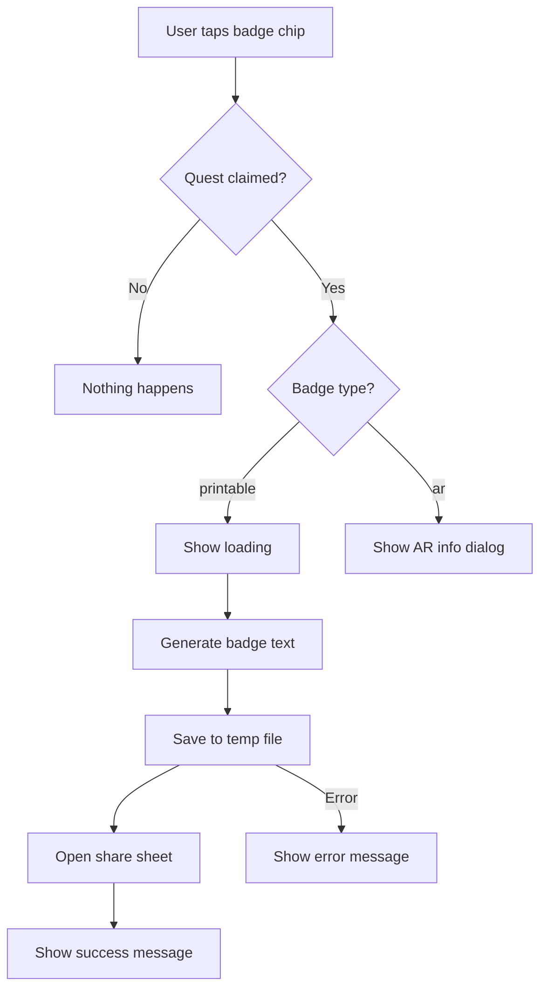

# Quick Reference: Calm Quests Implementation

## File Locations

### Main Files
- **UI Screen**: `dream-flow-app/app/lib/screens/calm_quests_screen.dart`
- **Quest Service**: `dream-flow-app/app/lib/services/quest_service.dart`
- **Documentation**: `docs/CALM_QUESTS_UI_FIXES.md`
- **Comparison**: `docs/CALM_QUESTS_BEFORE_AFTER.md`

## Key Methods

### `CalmQuestsScreen` Methods

```dart
// Load quests from service
Future<void> _loadQuests() async

// Handle printable badge tap (generates and shares)
Future<void> _handlePrintable(QuestReward reward) async

// Generate badge text content
String _generateBadgeContent(QuestReward reward)

// Handle AR badge tap (shows info dialog)
Future<void> _handleARBadge(QuestReward reward) async
```

### `_QuestCard` Widget

```dart
// Props
final CalmQuest quest;
final ValueChanged<int> onStepCompleted;
final VoidCallback onClaim;
final VoidCallback onPrintable;  // NEW
final VoidCallback onARBadge;    // NEW
```

## Badge Types

### Printable Badge
- **Type**: `"printable"`
- **Icon**: `Icons.print`
- **Action**: Generates text file and opens share sheet
- **Example**: "Printable cabin badge"

### AR Badge
- **Type**: `"ar"`
- **Icon**: `Icons.view_in_ar`
- **Action**: Shows informational dialog (future: AR viewer)
- **Example**: "Glow fox AR badge"

## Color Scheme

```dart
// Background colors
const Color(0xFF1A1A2E)  // Dark navy background
const Color(0xFF2D2D44)  // Card background
const Color(0xFF3D3D5C)  // Progress/chip background
const Color(0xFF4A4A6A)  // Claimed button background

// Accent colors
const Color(0xFF8B7FFF)  // Purple (primary action color)

// Text colors
Colors.white              // Primary text
Colors.white.withValues(alpha: 0.7)  // Secondary text
Colors.white.withValues(alpha: 0.6)  // Tertiary text
Colors.white.withValues(alpha: 0.5)  // Disabled text
Colors.white.withValues(alpha: 0.3)  // Borders
```

## Quest States

### 1. Incomplete Quest
```dart
quest.completedSteps < quest.steps.length
quest.isComplete == false
```
- Progress bar partially filled
- Some checkboxes checked
- Badge chip greyed out (0.5 opacity)
- No claim button

### 2. Complete, Not Claimed
```dart
quest.isComplete == true
quest.claimed == false
```
- Progress bar 100% filled
- All checkboxes checked
- Badge chip active (0.8 opacity)
- **Purple "Claim" button visible**

### 3. Claimed
```dart
quest.isComplete == true
quest.claimed == true
```
- Progress bar 100% filled
- All checkboxes checked
- **Badge chip clickable** (0.8 opacity)
- Grey "Claimed" button (disabled)

## How to Add New Quest

### In `quest_service.dart`

```dart
CalmQuest.defaults => [
  // ... existing quests
  CalmQuest(
    id: 'quest_unique_id',
    title: 'Quest Title',
    description: 'Complete X to earn Y.',
    steps: const [
      QuestStep(label: 'Step 1 description'),
      QuestStep(label: 'Step 2 description'),
      QuestStep(label: 'Step 3 description'),
    ],
    reward: QuestReward(
      title: 'Badge Name',
      type: 'printable', // or 'ar'
    ),
  ),
];
```

## How to Update Quest Progress

### From Other Screens

```dart
import '../services/quest_service.dart';

final questService = QuestService();

// Update progress
await questService.updateQuestProgress(
  questId: 'quest_cozy_cabin',
  completedSteps: 2, // Number of steps completed
);
```

### Common Use Cases

```dart
// When user completes a story in "Cozy Cabin" world
if (storyWorld == 'Cozy Cabin') {
  final currentProgress = ...; // Get current from quest service
  await questService.updateQuestProgress(
    questId: 'quest_cozy_cabin',
    completedSteps: currentProgress + 1,
  );
}

// When user downloads an offline pack
await questService.updateQuestProgress(
  questId: 'quest_travel_ready',
  completedSteps: numberOfDownloadedPacks,
);
```

## Share Badge Flow



## Badge File Format

### Text-Based Badge (Current)
```
━━━━━━━━━━━━━━━━━━━━━━━━━━━━━━━━━━
       DREAM FLOW ACHIEVEMENT
━━━━━━━━━━━━━━━━━━━━━━━━━━━━━━━━━━

            🎉 [BADGE NAME] 🎉

      Congratulations on completing
           your calm quest!

━━━━━━━━━━━━━━━━━━━━━━━━━━━━━━━━━━
    Date Earned: YYYY-MM-DD
━━━━━━━━━━━━━━━━━━━━━━━━━━━━━━━━━━

    Keep up the mindful practice! ✨
    
━━━━━━━━━━━━━━━━━━━━━━━━━━━━━━━━━━
```

### Future: PDF Badge
To implement PDF badges:
1. Add `pdf` package to pubspec.yaml
2. Create badge template with graphics
3. Generate PDF instead of text
4. Share PDF file

```dart
// Example PDF generation
import 'package:pdf/pdf.dart';
import 'package:pdf/widgets.dart' as pw;

Future<void> _generatePDFBadge(QuestReward reward) async {
  final pdf = pw.Document();
  
  pdf.addPage(
    pw.Page(
      build: (pw.Context context) {
        return pw.Center(
          child: pw.Column(
            children: [
              pw.Text('Dream Flow Achievement'),
              pw.Text(reward.title),
              // Add more styling...
            ],
          ),
        );
      },
    ),
  );
  
  final file = File('${dir.path}/badge.pdf');
  await file.writeAsBytes(await pdf.save());
}
```

## Troubleshooting

### Badge sharing doesn't work
**Check:**
- Is quest claimed? (`quest.claimed == true`)
- Is badge chip tappable? (Should have `InkWell`)
- Are permissions granted? (Should be automatic with `share_plus`)
- Check console for errors

### Claim button doesn't appear
**Check:**
- Are all steps complete? (`quest.completedSteps >= quest.steps.length`)
- Is quest already claimed? (`quest.claimed == true`)
- Is quest data loading correctly?

### UI doesn't match design
**Check:**
- Background color: `0xFF1A1A2E`
- Card color: `0xFF2D2D44`
- Text color: `Colors.white` with proper opacity
- Progress bar color: `0xFF8B7FFF`

### Checkboxes not updating
**Check:**
- `onStepCompleted` callback is firing
- `_loadQuests()` is called after update
- Quest service is saving correctly

## Performance Considerations

### Optimization Tips
1. **Use const constructors** where possible
2. **Avoid rebuilding entire list** - only update changed quest
3. **Lazy load badge content** - generate only when sharing
4. **Cache quest data** - already handled by SharedPreferences
5. **Dispose properly** - check `mounted` before setState

### Memory Usage
- Text badges are very small (~1KB)
- Temporary files are cleaned by OS
- No images loaded for basic badges
- Minimal overhead

## Future Enhancements

### Priority 1 (High Impact)
- [ ] PDF badge generation with graphics
- [ ] Badge gallery to view all earned badges
- [ ] Animations when claiming rewards
- [ ] Push notifications for quest completion

### Priority 2 (Medium Impact)
- [ ] AR badge viewing with camera
- [ ] Custom badge designs per quest type
- [ ] Social sharing integration (Twitter, Facebook)
- [ ] Badge rarity tiers (bronze, silver, gold)

### Priority 3 (Nice to Have)
- [ ] Badge trading/gifting
- [ ] Limited-time seasonal quests
- [ ] Leaderboards for quest completions
- [ ] Quest chains (complete A to unlock B)

## Related Files to Update

### When Adding New Quests
1. `quest_service.dart` - Add quest definition
2. *[Trigger location]* - Add progress update logic
3. Tests - Add quest validation tests

### When Changing Badge Format
1. `calm_quests_screen.dart` - Update `_generateBadgeContent()`
2. Tests - Update badge generation tests
3. Documentation - Update badge format examples

### When Adding New Badge Types
1. `quest_service.dart` - Add new `QuestReward` type
2. `calm_quests_screen.dart` - Add handler method
3. `calm_quests_screen.dart` - Update icon selection logic
4. Tests - Add new badge type tests

## Common Patterns

### Updating Progress from Story Completion
```dart
// In session_screen.dart or similar
Future<void> _onStoryComplete() async {
  // ... existing story completion logic
  
  // Update quest progress
  if (storyWorld == 'Cozy Cabin') {
    final questService = QuestService();
    final quests = await questService.getQuests();
    final cabinQuest = quests.firstWhere(
      (q) => q.id == 'quest_cozy_cabin',
      orElse: () => null,
    );
    
    if (cabinQuest != null && !cabinQuest.isComplete) {
      await questService.updateQuestProgress(
        questId: cabinQuest.id,
        completedSteps: cabinQuest.completedSteps + 1,
      );
    }
  }
}
```

### Adding Loading State to Badge Share
```dart
// Already implemented in _handlePrintable()
showDialog(
  context: context,
  barrierDismissible: false,
  builder: (context) => const Center(
    child: CircularProgressIndicator(),
  ),
);

// ... do work ...

Navigator.of(context).pop(); // Close loading
```

### Error Handling Pattern
```dart
try {
  // ... async operation ...
} catch (e) {
  // Close loading if open
  if (mounted && Navigator.of(context).canPop()) {
    Navigator.of(context).pop();
  }
  
  // Show error
  if (!mounted) return;
  ScaffoldMessenger.of(context).showSnackBar(
    SnackBar(
      content: Text('Error: $e'),
      backgroundColor: Colors.red,
    ),
  );
}
```

## Dependencies

### Required Packages (Already Installed)
```yaml
dependencies:
  share_plus: ^10.0.2        # Sharing functionality
  path_provider: ^2.1.4      # File system access
  permission_handler: ^11.3.1 # Permissions
  shared_preferences: ^2.2.2  # Quest data storage
```

### Import Statements
```dart
import 'package:flutter/material.dart';
import 'package:share_plus/share_plus.dart';
import 'dart:io';
import 'package:path_provider/path_provider.dart';
import '../services/quest_service.dart';
```

## Git Commit Message Template

```
feat(calm-quests): implement badge sharing functionality

- Add printable badge generation and sharing
- Redesign UI to match dark theme
- Implement custom checkboxes and progress bar
- Add AR badge placeholder functionality
- Improve claim button prominence
- Add loading states and error handling

Fixes: #[issue-number]
```

## Testing Checklist

### Unit Tests Needed
- [ ] Badge content generation
- [ ] Quest progress updates
- [ ] Quest claiming logic
- [ ] State transitions

### Widget Tests Needed
- [ ] Quest card rendering
- [ ] Checkbox interactions
- [ ] Claim button tap
- [ ] Badge chip tap

### Integration Tests Needed
- [ ] Full quest completion flow
- [ ] Badge sharing flow
- [ ] Error scenarios
- [ ] Multiple quests

## Support & Maintenance

### Common User Questions

**Q: How do I print my badge?**
A: Tap the badge chip after claiming, then select your print app from the share menu.

**Q: Where do badges go after sharing?**
A: They're saved to the location you choose in the share menu (email, messages, files, etc.)

**Q: Can I view my badges later?**
A: Yes, return to Calm Quests and tap the badge chip again.

**Q: Why can't I tap my badge?**
A: Make sure you've claimed the reward first by tapping the "Claim" button.

### Monitoring & Analytics

Consider tracking:
- Quest completion rates
- Badge share frequency
- Most popular quest types
- Time to complete quests
- Drop-off points in quest progress
